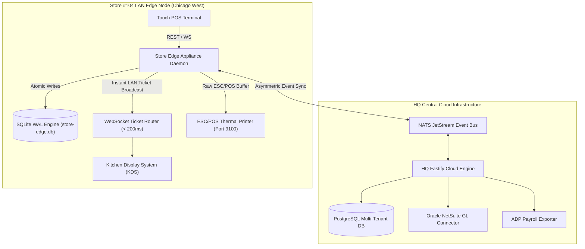

# 🏛️ Distributed Multi-Unit RMS System Architecture

This document details the architectural design, edge-cloud data topology, hardware driver layer, and conflict resolution model for the **Enterprise Multi-Unit Restaurant Management System (RMS)**.

---

## 1. System Topology Overview

---

## 2. Key Subsystems & Design Guarantees

### A. Edge Store Daemon (`store-edge-daemon`)
- **Native Persistence**: Runs `better-sqlite3` in Write-Ahead Logging (`WAL`) mode with `PRAGMA synchronous = NORMAL;`.
- **Fault Isolation**: Transactions are written locally before acknowledgement. If WAN drops, POS terminals continue functioning with 100% feature parity.
- **Hardware Layer**: Generates raw ESC/POS binary buffers (`0x1b 0x40` init, `0x1d 0x56 0x00` paper cut) dispatched via Node.js `net.Socket` to LAN thermal printers on Port 9100.

### B. Hierarchical Inheritance Engine (`core-inheritance`)
- **Resolution Order**:
  $$\text{Platform Default} \longrightarrow \text{Brand Policy} \longrightarrow \text{Regional Config} \longrightarrow \text{Store Local Override}$$
- **Brand Lock Protection**: Any menu item or recipe property flagged with `isBrandLocked === true` at the HQ level strips store-level local overrides automatically.

### C. Financial & BOM Depletion Engines
- **Gram-Level Recipe Engine**: Depletes raw ingredients based on recipe portion sizes, accounting for trim yield shrinkage factors ($Yield \% = \frac{\text{Edible Weight}}{\text{As Purchased Weight}}$).
- **Oracle NetSuite GL Accounting**: Constructs daily double-entry journal vouchers ensuring $\sum \text{Debits} = \sum \text{Credits}$.
- **ADP Payroll Exporter**: Exports regular hours, overtime (over 40h at $1.5\times$), role-weighted tip distribution math, and Fair Workweek break attestations.

---

## 3. Architecture Decision Records (ADRs)

- [ADR 001: SQLite WAL Mode over PostgreSQL on Edge Appliances](docs/adr/001-sqlite-wal-over-postgres-on-edge.md)
- [ADR 002: Vector-Clock & Hybrid Logical Clocks for Multi-Outlet Sync](docs/adr/002-vector-clock-conflict-resolution.md)
- [ADR 003: Direct ESC/POS TCP Socket Printing vs Cloud Print Microservices](docs/adr/003-escpos-tcp-over-cloud-printing.md)
