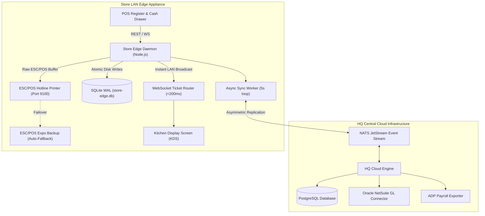

# System Architecture

This document describes the architectural design, edge-cloud data topology, hardware driver layer, and conflict resolution model for the Multi-Unit Restaurant Management System (RMS).

---

## 1. System Topology Overview

---

## 2. Core Architectural Components

### Edge Store Daemon (`src/store-edge/server.ts`)
- **Storage**: `better-sqlite3` configured with `PRAGMA journal_mode = WAL;` and `PRAGMA synchronous = NORMAL;`.
- **Failure Mode**: When internet connectivity drops, local registers continue processing orders. Checkouts write to the local SQLite database with `synced = 0`.
- **Background Sync**: A background worker periodically queries unsynced records and replicates them to the central cloud API when network connectivity is available.
- **Hardware Integration**: The ESC/POS driver generates raw binary buffers (`0x1b 0x40` init, `0x1d 0x56 0x00` cut) and transmits them over LAN TCP sockets to thermal printers on Port 9100. If the primary hotline printer fails or reports paper out via `DLE EOT`, the system automatically fails over to the backup expo printer.

### Hierarchical Inheritance Engine (`src/hq-cloud/tenant-inheritance-engine.ts`)
- **Resolution Order**: Platform Default -> Brand Policy -> Regional Config -> Store Local Override.
- **Brand Lock Protection**: Any menu item or recipe attribute flagged with `isBrandLocked === true` at the HQ level strips store-level local overrides automatically.

### Financial and Operational Engines
- **BOM Recipe Depletion**: Depletes raw ingredients based on recipe portion sizes, accounting for trim yield shrinkage factors.
- **NetSuite GL Accounting**: Constructs daily double-entry journal vouchers ensuring Debits equal Credits.
- **ADP Payroll Exporter**: Exports regular hours, California daily overtime, blended pay rates, and tip pool allocations.
- **Cash Management**: Enforces blind End-of-Day Z-report reconciliations to identify drawer cash variances.

---

## 3. Architecture Decision Records (ADRs)

- [ADR 001: SQLite WAL Mode over PostgreSQL on Edge Appliances](docs/adr/001-sqlite-wal-over-postgres-on-edge.md)
- [ADR 002: Vector-Clock & Hybrid Logical Clocks for Multi-Outlet Sync](docs/adr/002-vector-clock-conflict-resolution.md)
- [ADR 003: Direct ESC/POS TCP Socket Printing vs Cloud Print Microservices](docs/adr/003-escpos-tcp-over-cloud-printing.md)
