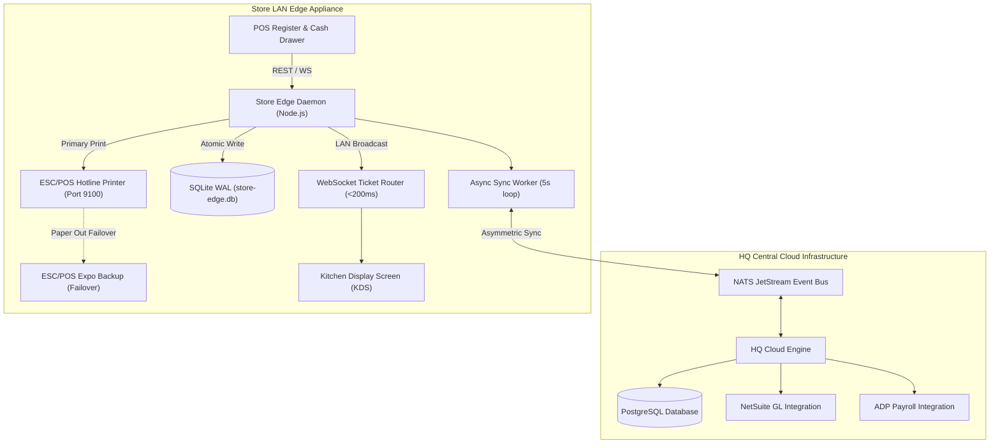

# Restaurant Management System (RMS) - Multi-Unit Edge Architecture

[](https://github.com/Alokkr00/Restaurant-Management-system/actions)
[](https://www.typescriptlang.org/)
[](https://vitejs.dev/)
[](https://www.sqlite.org/wal.html)
[](https://vitest.dev/)
[](LICENSE)

A hybrid on-premise and cloud restaurant management system designed for multi-unit franchise networks and restaurant holding groups.

The system uses an offline-first local edge daemon (`store-edge-daemon`) running SQLite in Write-Ahead Logging (WAL) mode for low-latency store operations, a background reconciliation worker for cloud synchronization, ESC/POS hardware printer drivers with station failover, and operational back-office engines covering FLSA-compliant tip pooling, state overtime rules, NetSuite double-entry GL journals, and cash drawer management.

---

## Architectural Motivation

Cloud-only POS systems introduce a single point of failure during internet service provider (ISP) degradation or payment gateway outages. During peak lunch and dinner rushes, offline durability is critical to prevent halted kitchen prep and blocked checkout lines.

This repository implements a store-level edge node architecture:
- Each store operates a local node running an embedded SQLite database (`store-edge.db`) configured in Write-Ahead Logging (WAL) mode.
- POS registers and Kitchen Display System (KDS) screens communicate over local LAN WebSockets with sub-200ms latency.
- Transactions, inventory depletions, and shift timecards are written locally first.
- A background worker (`EdgeCloudSyncWorker`) monitors unsynced records (`synced = 0`) and flushes transaction batches to central cloud endpoints when WAN connectivity is available.

---

## System Architecture



---

## Architecture Decision Records (ADRs)

Detailed technical decisions and architectural tradeoffs are documented in the `docs/adr/` directory:

- **[ADR 001: SQLite WAL Mode over PostgreSQL on Edge](docs/adr/001-sqlite-wal-over-postgres-on-edge.md)** — Embedded memory footprint (<15MB), single-writer serial throughput, and crash recovery.
- **[ADR 002: Vector-Clock & Hybrid Logical Clocks for Sync](docs/adr/002-vector-clock-conflict-resolution.md)** — Handling physical clock drift and enforcing HQ brand lock priority.
- **[ADR 003: Direct ESC/POS TCP Socket Printing](docs/adr/003-escpos-tcp-over-cloud-printing.md)** — Direct socket binary printing over LAN Port 9100 with hardware status polling.

---

## Key Modules and Domain Logic

### 1. Cash Drawer Management (`src/pos/cash-management.ts`)
- Manages drawer opening float banks, mid-shift safe drops, and petty cash payouts with manager approval reason codes.
- Generates blind End-of-Day (EOD) Z-Reports where cashiers count physical currency without previewing expected system totals, computing over/short variance.

### 2. Order Lifecycle & Audited Comps (`src/pos/order-lifecycle.ts`)
- Distinguishes **Voids** (item not prepared, inventory restored) from **Comps** (item prepared and served, inventory depleted).
- Handles complex modifier hierarchies, ingredient exclusions (`NO Onion`), substitutions (`SUB Vegan Cheese`), and split pizza toppings (`LEFT_HALF`, `RIGHT_HALF`, `WHOLE`).

### 3. FLSA Tip Pooling Compliance (`src/fintech/tip-pooling-engine.ts`)
- Enforces FLSA Section 3(m)(2)(B) excluding managers and shift leads with supervisory authority from tip pools.
- Enforces tip credit regulations restricting back-of-house staff from tip pools when an employer claims a tip credit against minimum wage.

### 4. Overtime & Blended Pay Rates (`src/integrations/adp.ts`)
- Implements California daily overtime rules (>8 hours/day at 1.5x, >12 hours/day at 2.0x) aggregated across multi-shift workdays.
- Computes blended regular rates of pay for employees working multiple roles at different wage rates in the same pay period.

### 5. NetSuite Double-Entry GL Journal (`src/integrations/netsuite.ts`)
- Generates balanced daily general ledger journals ($\sum \text{Debits} \equiv \sum \text{Credits}$) across Cash on Hand (1010), Merchant Card Clearing (1020), 3rd-Party Delivery AR (1030), Tip Liability (2020), Sales Tax Payable (2010), and Food Revenue (4010).

### 6. Unit of Measure (UOM) Conversions (`src/inventory/uom-conversion.ts`)
- Cascades conversions from purchasing packaging (e.g. 50lb bag) to storage inventory (pounds/kilograms) to recipe depletion (grams/ounces).
- Computes dynamic morning prep par levels from sales forecasts and historical item velocity.

---

## Test Coverage

The test suite contains 26 tests across 13 domain-organized test files:

```bash
npm test
```

```text
 ✓ tests/netsuite-gl.test.ts        (1 test passed)
 ✓ tests/inventory-recipe.test.ts   (2 tests passed)
 ✓ tests/tip-pooling.test.ts        (2 tests passed)
 ✓ tests/sync-engine.test.ts        (2 tests passed)
 ✓ tests/adp-payroll.test.ts        (2 tests passed)
 ✓ tests/escpos-printer.test.ts     (3 tests passed)
 ✓ tests/tenant-isolation.test.ts   (3 tests passed)
 ✓ tests/royalty.test.ts            (1 test passed)
 ✓ tests/labor-compliance.test.ts   (2 tests passed)
 ✓ tests/order-lifecycle.test.ts    (2 tests passed)
 ✓ tests/tax-engine.test.ts         (3 tests passed)
 ✓ tests/uom-conversion.test.ts     (2 tests passed)
 ✓ tests/cash-management.test.ts    (1 test passed)

 Test Files  13 passed (13)
      Tests  26 passed (26)
```

---

## Getting Started

### Requirements
- Node.js >= 20.x
- npm >= 10.x

### Setup
```bash
git clone https://github.com/Alokkr00/Restaurant-Management-system.git
cd Restaurant-Management-system
npm install
```

### Development
```bash
# Start edge node daemon (SQLite WAL active on port 3001)
npm run dev:edge

# Start web interface (Vite on port 5173)
npm run dev:ui

# Run test suite
npm test
```

### Docker Deployment
```bash
docker-compose -f docker-compose.edge.yml up -d
```

---

## License

MIT License. See [LICENSE](LICENSE) for details.
