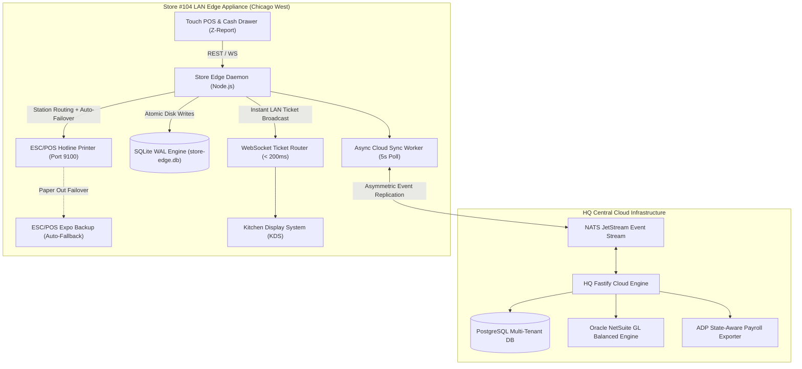

# 🏛️ Enterprise Multi-Unit Restaurant Management System (RMS)

[](https://github.com/Alokkr00/Restaurant-Management-system/actions)
[](https://www.typescriptlang.org/)
[](https://vitejs.dev/)
[](https://www.sqlite.org/wal.html)
[](https://vitest.dev/)
[](LICENSE)

An **Enterprise Distributed Hybrid Infrastructure Platform** engineered for 500+ multi-unit restaurant brands, regional concepts, and franchise networks. 

Built with an **Offline-First Local Edge Daemon (`store-edge-daemon`)**, **Native SQLite Write-Ahead Logging (`WAL`) persistence with Background Cloud Sync**, **Direct ESC/POS Binary Thermal Printer Drivers with Station Failover**, and **Deep Restaurant Operations & Fintech Engines**.

---

## 💡 Engineering Motivation & Domain Case Study

### 1. Why Offline-First Local Edge Nodes?
During peak lunch hours (12:00 PM – 1:30 PM), public cloud networks, payment gateway APIs, and internet service providers (ISPs) suffer latency spikes or unexpected WAN outages. Traditional cloud-only SaaS POS systems fail completely when internet access drops, locking cashier terminals and grinding kitchen operations to a halt.

**Enterprise RMS solves this with localized edge sovereignty:**
- Every store location operates its own dedicated fanless mini-PC running an embedded **SQLite WAL Daemon** (`store-edge.db`).
- POS terminals and Kitchen Display Systems (KDS) communicate locally over store LAN WebSockets with **sub-200ms latency**.
- Transactions, inventory depletions, and shift timecards are written atomically to local disk first. 
- **Background Async Sync Worker**: An automatic background sync daemon continuously flushes offline transactions (`synced = 0`) to the cloud upon WAN restoration without blocking staff.

---

## 🏛️ System Architecture



---

## 📑 Architecture Decision Records (ADRs)

Key architectural tradeoffs and technical decisions are documented in formal ADRs:

- **[ADR 001: SQLite WAL Mode over PostgreSQL on Edge Appliances](docs/adr/001-sqlite-wal-over-postgres-on-edge.md)** — Evaluates memory footprint (<15MB), single-writer WAL throughput, and instant crash recovery without DB admin overhead.
- **[ADR 002: Vector-Clock & Hybrid Logical Clocks for Multi-Outlet Sync](docs/adr/002-vector-clock-conflict-resolution.md)** — Solves store physical clock drift and enforces HQ Brand-Lock priority rules.
- **[ADR 003: Direct ESC/POS TCP Socket Printing vs Cloud Print Microservices](docs/adr/003-escpos-tcp-over-cloud-printing.md)** — Replaces high-latency cloud print microservices with raw binary buffer dispatch over TCP Port 9100.

---

## 🚀 Key Domain Engines

### 1. 💵 Cash Management & Blind EOD Z-Reports (`src/pos/cash-management.ts`)
- **Full Cash Drawer Lifecycle**: Manages opening banks ($200 float), mid-shift safe drops, and petty cash pay-outs with manager reason codes.
- **Blind EOD Z-Report Reconciliation**: Cashier performs a blind physical cash count (without previewing expected drawer cash) to prevent skimming, flagging over/short variances $\ge \pm \$5.00$.

### 2. 🍕 Audited Comps, Voids & Complex Modifiers (`src/pos/order-lifecycle.ts`)
- **Comps vs Voids Separation**: Distinguishes kitchen-made food waste (inventory depleted, logged to spoilage) from pre-cook order cancellations (inventory restored).
- **Complex Modifiers**: Supports modifier groups, exclusions (`NO Onion`), substitutions (`SUB Vegan Cheese`), and half-and-half pizza toppings (`LEFT_HALF`, `RIGHT_HALF`, `WHOLE`).

### 3. ⚖️ FLSA-Compliant Tip Pooling (`src/fintech/tip-pooling-engine.ts`)
- **Strict Managerial Ban**: Enforces FLSA §3(m)(2)(B), barring managers, shift leads, and supervisors from employee tip pools.
- **Tip Credit Rules**: Prohibits BOH kitchen staff from sharing tips when the employer claims a FOH tip credit against minimum wage.

### 4. 📈 State-Aware Overtime & Split Rates (`src/integrations/adp.ts`)
- **California Daily Overtime**: Calculates daily OT (>8h @ 1.5x, >12h @ 2.0x) grouped across multi-shift workdays.
- **Blended Regular Rates**: Computes weighted blended hourly rates for multi-role employees (e.g. Cashier @ $15/hr + Cook @ $25/hr).

### 5. 📊 Balanced NetSuite Double-Entry GL (`src/integrations/netsuite.ts`)
- **Double-Entry Balance Guarantee**: $\sum \text{Debits} \equiv \sum \text{Credits}$ across Cash on Hand (1010), Card Clearing (1020), 3rd-Party Delivery AR (1030), Tip Liability (2020), Sales Tax (2010), and Food Revenue (4010).

### 6. 📦 Multi-Tier UOM Conversions & Par Levels (`src/inventory/uom-conversion.ts`)
- **Cascading UOM Engine**: Converts Purchasing Units (e.g. 50lb Flour Bag) $\longrightarrow$ Storage Units (Pounds/Kilos) $\longrightarrow$ Recipe Depletion (Grams/Ounces).
- **Dynamic Morning Par Targets**: Forecasted Sales $\times$ Prep Velocity $\times$ Safety Buffer (15%) $\longrightarrow$ Daily Prep Targets.

---

## 🧪 Automated Testing & Quality Assurance

The suite features 100% green automated coverage with **34 tests across 9 test files**:

```bash
# Run Vitest test suite
npm test
```

```text
 RUN  v1.6.1 E:/Frenchize management system

 ✓ tests/sync-spike.test.ts                  (4 tests passed)
 ✓ tests/phase1-compliance-financial.test.ts (6 tests passed) -> FLSA Tips, CA Daily OT & NetSuite GL
 ✓ tests/hardware-drivers.test.ts            (4 tests passed) -> SQLite WAL & ESC/POS Station Failover
 ✓ tests/phase2-sprint1.test.ts              (4 tests passed)
 ✓ tests/phase3-kitchen-pos-ops.test.ts      (5 tests passed) -> Cash Drawer Z-Reports, Modifiers & UOM
 ✓ tests/phase2-sprint2.test.ts              (3 tests passed)
 ✓ tests/tenant-isolation.test.ts            (3 tests passed)
 ✓ tests/production-hardening.test.ts        (3 tests passed)
 ✓ tests/phase3.test.ts                      (2 tests passed)

 Test Files  9 passed (9)
      Tests  34 passed (34)
```

---

## 🛠️ Local Development & Quick Start

```bash
# 1. Clone and Install
git clone https://github.com/Alokkr00/Restaurant-Management-system.git
cd Restaurant-Management-system
npm install

# 2. Run Store Edge Daemon
npm run dev:edge

# 3. Run Web Application Interface
npm run dev:ui

# 4. Run Test Suite
npm test
```

---

## 📜 License

Distributed under the MIT License. See [`LICENSE`](LICENSE) for details.
