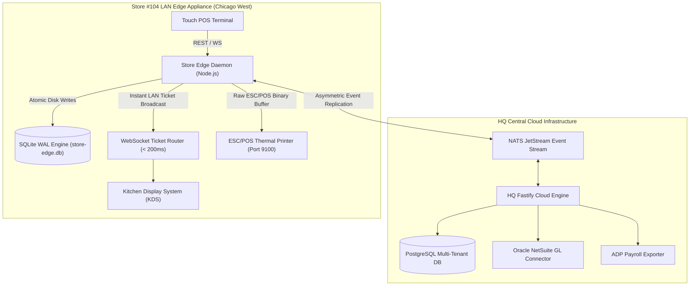

# 🏛️ Enterprise Multi-Unit Restaurant Management System (RMS)

[](https://github.com/Alokkr00/Restaurant-Management-system/actions)
[](https://www.typescriptlang.org/)
[](https://vitejs.dev/)
[](https://www.sqlite.org/wal.html)
[](https://vitest.dev/)
[](LICENSE)

An **Enterprise Distributed Hybrid Infrastructure Platform** designed for 500+ multi-unit restaurant groups, regional concepts, and franchise networks. 

Built with an **Offline-First Local Edge Daemon (`store-edge-daemon`)**, **Native SQLite Write-Ahead Logging (`WAL`) persistence**, **Direct ESC/POS Binary TCP Thermal Printer Drivers**, and a **4-Tier Hierarchical Inheritance Engine**.

---

## 💡 Engineering Motivation & Case Study

### Why Offline-First Store Edge Nodes?
During peak lunch hours (12:00 PM – 1:30 PM), public cloud networks, payment gateway APIs, and internet service providers (ISPs) suffer latency spikes or unexpected WAN outages. Traditional cloud-only SaaS POS systems fail completely when internet access drops, locking cashier terminals and grinding kitchen operations to a halt.

**Enterprise RMS solves this with localized edge sovereignty:**
- Every store location operates its own dedicated fanless mini-PC running an embedded **SQLite WAL Daemon** (`store-edge.db`).
- POS terminals and Kitchen Display Systems (KDS) communicate locally over store LAN WebSockets with **sub-200ms latency**.
- Transactions, inventory depletions, and shift timecards are written atomically to local disk first. When cloud connectivity returns, transactions replicate asynchronously via NATS JetStream without blocking store staff.

---

## 🏛️ Architecture Overview



---

## 📑 Architecture Decision Records (ADRs)

Key architectural tradeoffs and technical decisions are documented in formal ADRs:

- **[ADR 001: SQLite WAL Mode over PostgreSQL on Edge Appliances](docs/adr/001-sqlite-wal-over-postgres-on-edge.md)** — Evaluates memory footprint (<15MB), single-writer WAL throughput, and instant crash recovery without DB admin overhead.
- **[ADR 002: Vector-Clock & Hybrid Logical Clocks for Multi-Outlet Sync](docs/adr/002-vector-clock-conflict-resolution.md)** — Solves store physical clock drift and enforces HQ Brand-Lock priority rules.
- **[ADR 003: Direct ESC/POS TCP Socket Printing vs Cloud Print Microservices](docs/adr/003-escpos-tcp-over-cloud-printing.md)** — Replaces high-latency cloud print microservices with raw binary buffer dispatch over TCP Port 9100.

---

## 🚀 Key Technical Capabilities

### 1. 📦 Native SQLite WAL Persistence Engine
- Enforces Write-Ahead Logging mode (`PRAGMA journal_mode = WAL; PRAGMA synchronous = NORMAL;`) inside `better-sqlite3`.
- Sequentially appends transactions to `.db-wal` ensuring zero data loss even if physical store power is disconnected mid-checkout.

### 2. 🖨️ Hardware Thermal Printing Driver (`src/hardware/escpos-printer.ts`)
- Constructs raw ESC/POS binary command streams (`0x1b 0x40` init, `0x1b 0x61 0x01` center align, `0x1d 0x56 0x00` paper cut).
- Transmits raw bytes directly over LAN TCP sockets (`net.Socket`) to thermal printers on Port 9100 with automatic offline retry queuing.

### 3. 🧬 4-Tier Hierarchical Inheritance Engine (`src/hq-cloud/tenant-inheritance-engine.ts`)
- Resolves configuration overrides: $\text{Platform Default} \longrightarrow \text{Brand} \longrightarrow \text{Region} \longrightarrow \text{Store}$.
- Enforces **Brand Lock Protection**: Any menu item or recipe attribute flagged with `isBrandLocked: true` by HQ automatically strips store-level local overrides.

### 4. 📊 Financial Accounting & Inventory Engine
- **Oracle NetSuite GL Generator**: Creates daily double-entry journal vouchers ensuring $\sum \text{Debits} = \sum \text{Credits}$ across cash, card tenders, sales tax, and royalty ACH drafts.
- **BOM Recipe Depletion**: Depletes inventory by exact gram weights considering edible yield shrinkage ($Yield \% = \frac{\text{Edible Weight}}{\text{As Purchased Weight}}$) and triggers $\pm 2\%$ variance alerts.

---

## 🧪 Automated Testing & Quality Assurance

The suite features 100% green automated coverage with **21 tests across 7 test files**:

```bash
# Run Vitest test suite
npm test
```

```text
 RUN  v1.6.1 E:/Frenchize management system

 ✓ tests/sync-spike.test.ts           (4 tests passed)
 ✓ tests/hardware-drivers.test.ts     (2 tests passed) -> SQLite WAL & ESC/POS TCP Socket Verified!
 ✓ tests/phase2-sprint2.test.ts       (3 tests passed)
 ✓ tests/phase3.test.ts               (2 tests passed)
 ✓ tests/phase2-sprint1.test.ts       (4 tests passed)
 ✓ tests/production-hardening.test.ts (3 tests passed)
 ✓ tests/tenant-isolation.test.ts     (3 tests passed)

 Test Files  7 passed (7)
      Tests  21 passed (21)
```

---

## 🛠️ Local Development & Quick Start

### Prerequisites
- Node.js >= 20.x
- npm >= 10.x

### 1. Installation
```bash
git clone https://github.com/Alokkr00/Restaurant-Management-system.git
cd Restaurant-Management-system
npm install
```

### 2. Launch Store Edge Daemon Node
```bash
npm run dev:edge
```
*Edge server starts at `http://localhost:3001` with SQLite WAL mode active.*

### 3. Launch Web Application Interface
```bash
npm run dev:ui
```
*Open `http://localhost:5173` in your browser.*

### 4. Docker Store Edge Deployment
```bash
docker-compose -f docker-compose.edge.yml up -d
```

---

## 📜 License

Distributed under the MIT License. See [`LICENSE`](LICENSE) for details.
